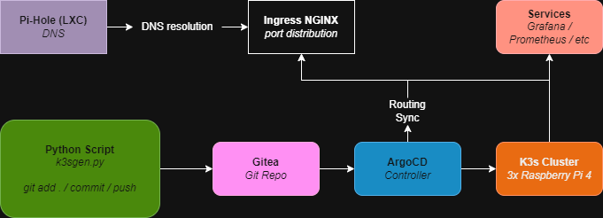

# k3s-manifest-generator

A Python script that generates production-ready Kubernetes manifests (Deployment + Service + Ingress) through an interactive CLI, and saves them directly to a local Git repository for ArgoCD to auto-sync to a K3s cluster.

No more writing YAML by hand. Fill in the prompts, run the script, push to Git — ArgoCD handles the rest.

---

## GitOps Flow



The script sits at the start of the GitOps pipeline. Once the manifest is generated and pushed, ArgoCD detects the change and applies it to the cluster automatically — no manual `kubectl apply` required.

---

## Prerequisites

- Python 3.13 or newer
- VSCode or any Python-compatible editor
- A K3s cluster with ArgoCD + Gitea configured — see [argocd-k3s-gitea](https://github.com/AdrianStudio/argocd-k3s-gitea) for a step-by-step setup guide
- Local clone of your Gitea repository (`git clone http://your-gitea/repo`)
- A DNS server resolving your custom domain (Pi-hole, CoreDNS, or equivalent)

---

## Setup

Clone this repository:

```bash
git clone https://github.com/AdrianStudio/k3s-manifest-generator
cd k3s-manifest-generator
```

Update `ruta_base` in `k3sgen.py` to point to your local Gitea repo clone:

```python
ruta_base = r"C:\your\path\to\homelab\k3s\argocd"
```

---

## Usage

```bash
python k3sgen.py
```

The script will prompt you for the service configuration:

```
Service name: hello-world
Target namespace: homelab
Container image (e.g., nginxdemos/hello:latest): nginxdemos/hello:latest
Container port to expose: 80
Number of replicas [default: 1]: 1
Service type (ClusterIP / NodePort / LoadBalancer): ClusterIP
Enable Ingress? (yes/no): yes
Configure CPU/memory resource limits? (yes/no): yes
```

Once complete, push to Git and let ArgoCD sync:

```bash
cd your/homelab/repo
git add .
git commit -m "feat: add hello-world manifest"
git push
```

---

## Example Output

```yaml
apiVersion: apps/v1
kind: Deployment
metadata:
  name: hello-world
  namespace: homelab
spec:
  replicas: 1
  selector:
    matchLabels:
      app: hello-world
  template:
    metadata:
      labels:
        app: hello-world
    spec:
      containers:
      - name: hello-world
        image: nginxdemos/hello:latest
        ports:
        - containerPort: 80
        resources:
          requests:
            memory: "64Mi"
            cpu: "100m"
          limits:
            memory: "128Mi"
            cpu: "200m"
---
apiVersion: v1
kind: Service
metadata:
  name: hello-world
  namespace: homelab
spec:
  type: ClusterIP
  selector:
    app: hello-world
  ports:
  - port: 80
    targetPort: 80
---
apiVersion: networking.k8s.io/v1
kind: Ingress
metadata:
  name: hello-world-ingress
  namespace: homelab
  annotations:
    nginx.ingress.kubernetes.io/rewrite-target: /
spec:
  ingressClassName: nginx
  rules:
  - host: hello-world.homelab
    http:
      paths:
      - path: /
        pathType: Prefix
        backend:
          service:
            name: hello-world
            port:
              number: 80
```

---

## Resource Limits

When enabled, the script applies fixed resource limits optimised for **Raspberry Pi 4** hardware. Adjust the values directly in `k3sgen.py` if your setup differs.

| Type | Memory | CPU |
|------|--------|-----|
|  | `64Mi` | `100m` |
|  | `128Mi` | `200m` |

> Requests define the minimum resources guaranteed to the container. Limits define the maximum it can consume before being throttled or evicted.

---

## Stack

| Component | Role | Badge |
|-----------|------|-------|
| K3s | Lightweight Kubernetes on 3x Raspberry Pi 4 |  |
| ArgoCD | GitOps continuous deployment controller |  |
| Gitea | Self-hosted Git repository |  |
| Ingress NGINX | Traffic routing and host-based rules |  |
| Pi-hole | Local DNS resolution for custom domain |  |
| Python | Manifest generation script |  |

---

This project is part of a larger homelab where everything is built, documented, and automated from scratch. Feel free to use it, adapt it to your own cluster, and open an issue if you run into anything — happy to help.
